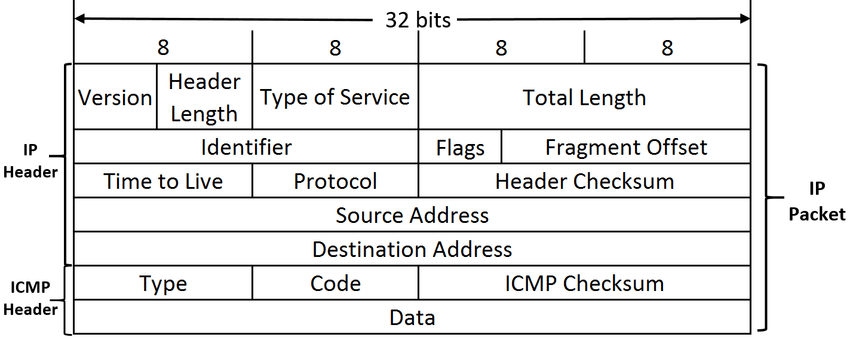
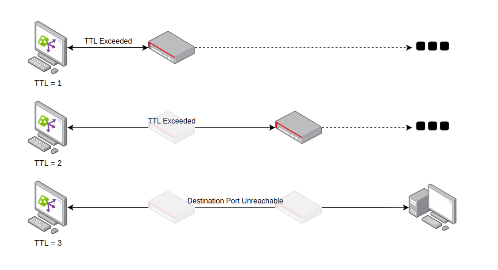
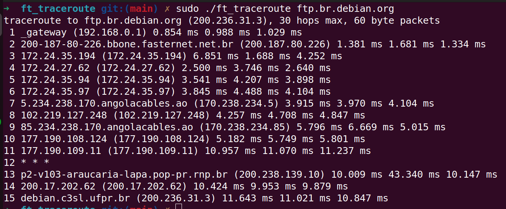

# ft_traceroute

> Have you ever faced a situation where you need to know how your machine connects to a host on the internet? Or how many network nodes your packages need to travel to reach another host on a private network, perhaps? How many seconds the packages are travelling between each node? If you said yes to one or more questions, this tool might help you in your troubleshooting problems.

The `ft_traceroute` goal is to be my own implementation of the famous UNIX command `traceroute`, which shows all the nodes a packet need to travel to reach another host in a network. More than that, the command shows us the round trip time for each packet whenever it hits a node, its set TTL and the node IPv4 address (if possible, the reverse DNS is resolved).

## How it works

### Time to Live

The "Time to Live" (TTL) is a value in an Internet Protocol (IP) packet that tells a network router whether or not the packet has been in the network too long and should be discarded. In IPv4, the TTL field in each packet is decremented by one every time the packet is processed by a router. When the TTL field hits zero, the router discards the packet and typically sends an ICMP "Time Exceeded" message to the sender.

This ICMP packet provide us the typical ICMP header for a apcket, including its type and code, which is important to know if the packet was discarded because of its TTL or because of another reason. The ICMP packet also provides us the IP header of the original packet, which is important to know the original destination IP address and the original TTL value.



### Traceroute

The `ft_traceroute` command works by sending a number of UDP packets (which are called "probes") with an incremeting TTL value. The first probes are sent with TTL value of 1, so the first router it hits will discard the packets and send an ICMP "Time Exceeded" message back to the sender. The sender will then send the second set of probes with TTL value of 2, expecting a return, and so on.

This process continues until the packet reaches the destination host, which will send an ICMP "Port Unreachable" message back to the sender. When this happens, the `ft_traceroute` command will know that the destination was reached and will stop sending probes.



The output of the `ft_traceroute` command is summarized as a table; each line contains the TTL value, the node reverse DNS value (if appliable) and its IP address, and the round trip time (RTT) for each probe. If the destination host is not reached after 3 probes, the line will be marked with an asterisk (`*`).



## How to Run

### Compiling

The `ft_traceroute` command can be compiled by running the `make` command inside the root directory. This will generate a `ft_traceroute` executable file. It requires the `clang` compiler and the `make` command to be installed.

```bash
$> make
```

### Running

The `ft_traceoute` command is a standalone executable that can be run from the command line. It takes a single argument, which is the destination host to be reached. The command must be run as root, since it uses raw sockets to send and receive packets.

```bash
$> sudo ./ft_traceroute google.com
```

The command accepts the following options:

- `-h`: Shows the help message.
- `-m <max_ttl>`: Sets the maximum TTL value to be used. The default value is 30.
- `-q <nprobes>`: Sets the number of probes to be sent for each TTL value. The default value is 3.
- `-w <waittime>`: Sets the time to wait for a response for each probe. The default value is 5 seconds.
- `-p <port>`: Sets the destination port to be used. The default value is 33434.

Further information about the command can be found by running `./ft_traceroute --help` and `./ft_traceroute --usage`.

## References

- [RFC 792 - Internet Control Message Protocol](https://tools.ietf.org/html/rfc792)
- [Parsing Program Options with argp](https://www.gnu.org/software/libc/manual/html_node/Argp.html)
- [traceroute.c](https://opensource.apple.com/source/network_cmds/network_cmds-77/traceroute.tproj/traceroute.c.auto.html)

## License

This project is licensed under the MIT License - see the [LICENSE](LICENSE) file for details.
